# HHA504 — MySQL on VM vs Managed SQL (Google Cloud SQL)

This repository demonstrates two approaches to hosting MySQL:

1. **Self-managed MySQL on a Google Compute Engine VM**
2. **Google Cloud SQL — Managed MySQL Instance**

Both environments were connected to from Python using SQLAlchemy, with screenshots and scripts included as required.

---

# 📁 Repository Structure

```
HHA504_mysql_vm_vs_managed/
│
├── docs/
│
├── screenshots/
│   ├── vm/
│   │   ├── apt-update.png
│   │   ├── bind-address.png
│   │   ├── firewall-mysql-3306.png
│   │   ├── mariadb-install.png
│   │   ├── mariadb-shell.png
│   │   ├── mariadb-status-after-restart.png
│   │   ├── mariadb-status.png
│   │   ├── mysql-version.png
│   │   ├── show-databases.png
│   │   ├── ssh-open.png
│   │   ├── vm_created.png
│   │   ├── vm-demo-output.png
│   │   ├── vm-external-ip.png
│   │
│   ├── managed/
│       ├── authorized-ip-networks.png
│       ├── connection-info.png
│       ├── managed-mysql-instance.png
│       ├── managed-python-success.png
│       ├── managed-sql-overview.png
│       ├── managed-users.png
│       ├── repo-structure.png
│       ├── ssl-certs-page.png
│
├── scripts/
│   ├── vm_demo.py
│   ├── managed_demo.py
│
├── sql/
│   └── schema.sql
│
├── .env.example
├── .env
├── .gitignore
└── README.md
```

---

# 🖥️ Part 1 — MySQL on a Google Compute Engine VM

This section documents installing, configuring, and testing MariaDB/MySQL on a VM.

**Note:** Ubuntu installs MariaDB by default when installing MySQL packages. MariaDB is fully MySQL-compatible and works identically for the requirements of this assignment.

## **1️⃣ Create VM**
**Screenshot:**  
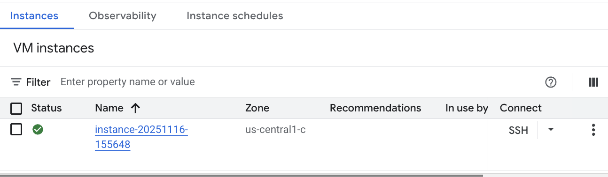

## **2️⃣ SSH into VM**
**Screenshot:**  
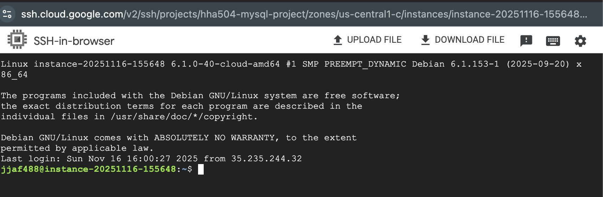

## **3️⃣ Update & Install MariaDB**
**Screenshots:**  
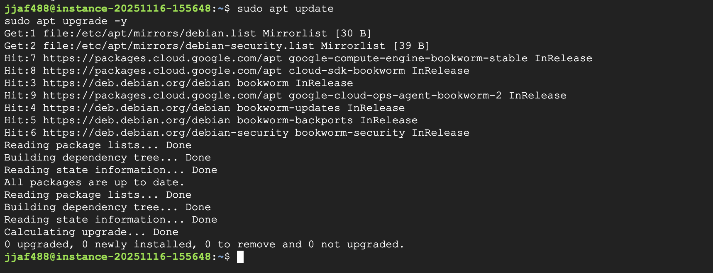
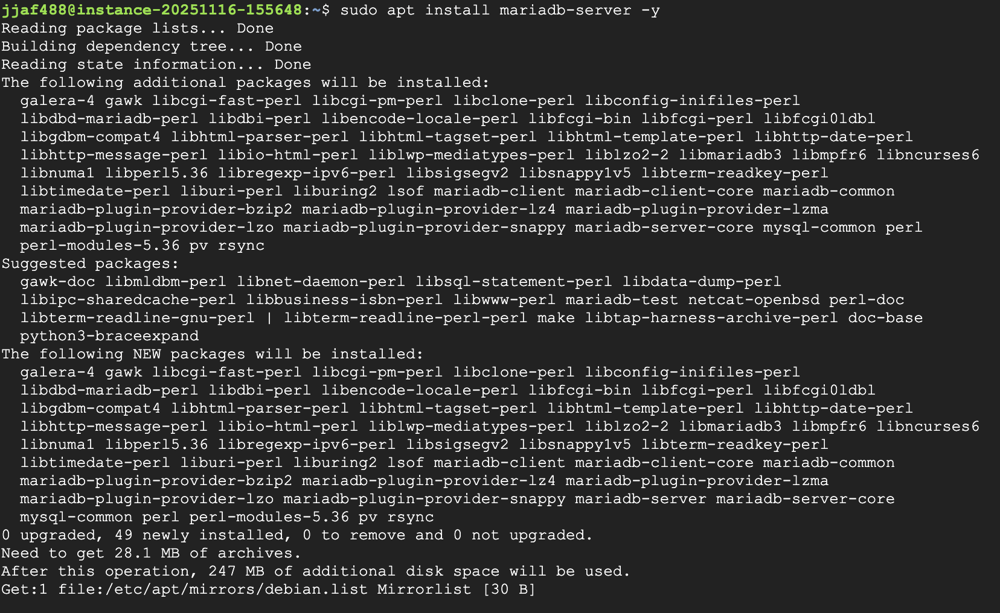

## **4️⃣ Check MySQL Version**
**Screenshot:**  
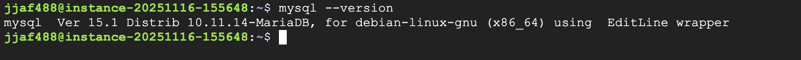

## **5️⃣ Modify bind-address to allow external access**
**Screenshot:**  
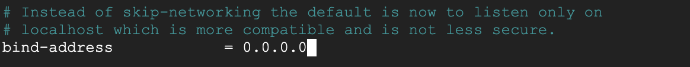

## **6️⃣ Open firewall port 3306**
**Screenshot:**  
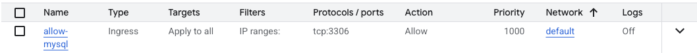

## **7️⃣ Restart MariaDB**
**Screenshot:**  
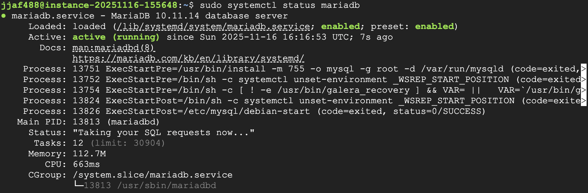

## **8️⃣ Enter MariaDB shell**
**Screenshot:**  
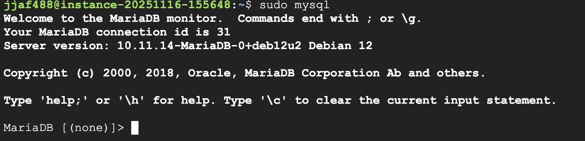

## **9️⃣ Show Databases**
**Screenshot:**  
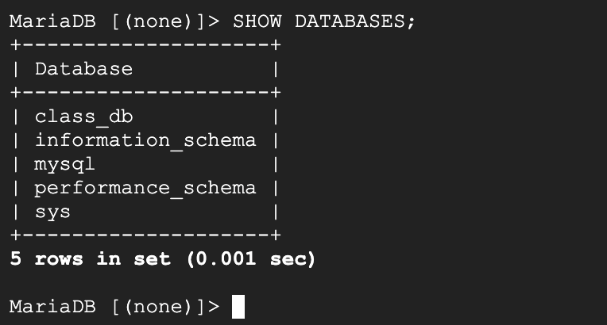

## **🔟 Python Script Success (VM)**
**Screenshot:**  
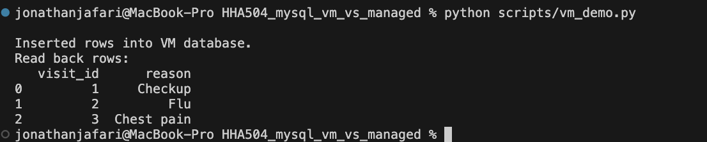

---

# 🗄️ Part 2 — Google Cloud SQL (Managed MySQL)

This section documents using a fully managed MySQL instance with SSL connections.

## **1️⃣ Managed MySQL Instance Overview**
**Screenshot:**  
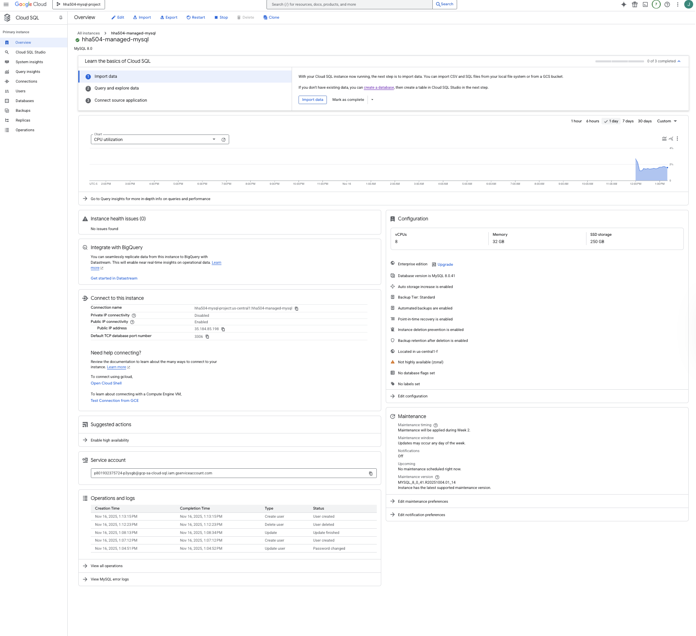

## **2️⃣ Connection Details**
**Screenshot:**  
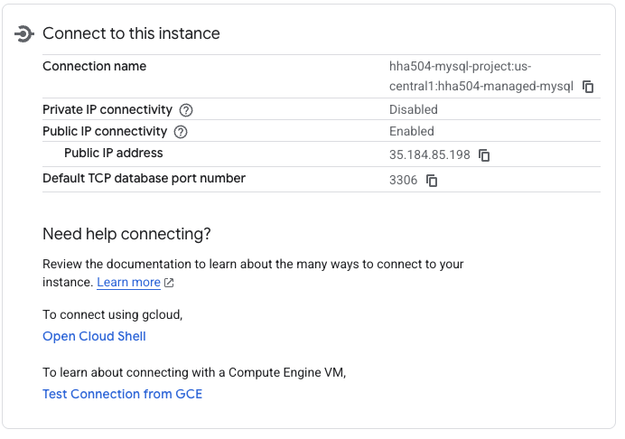

## **3️⃣ Authorized Networks (Your Home IP)**
**Screenshot:**  
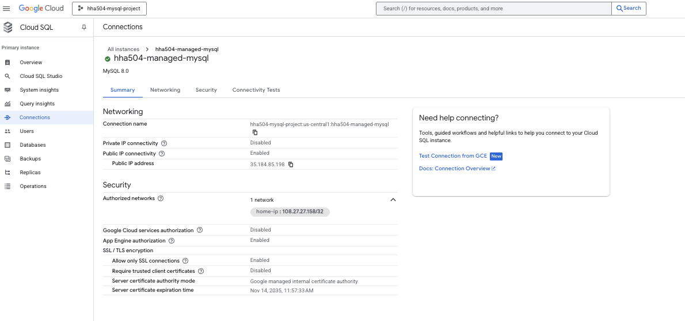

## **4️⃣ Users Section**
**Screenshot:**  
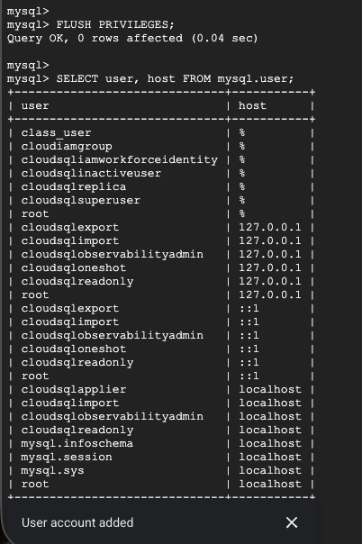

## **5️⃣ SSL Certificate Files Page**  
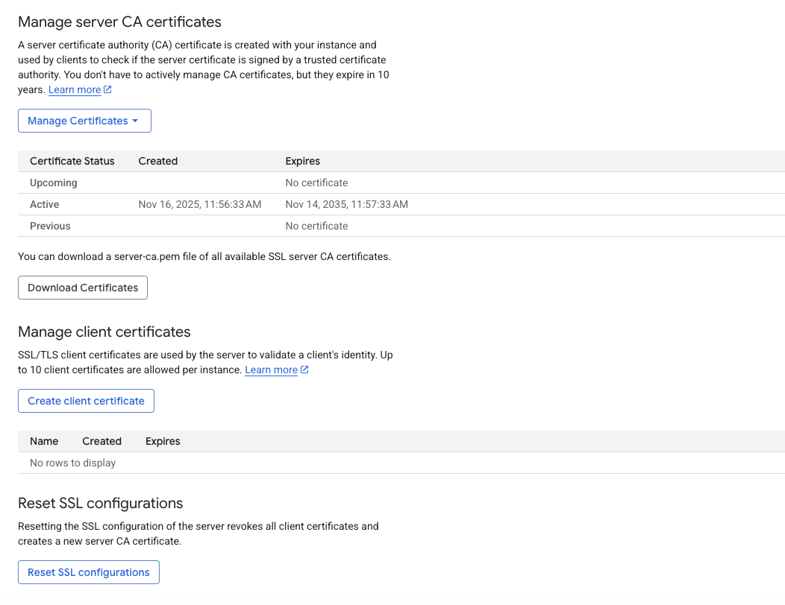

This page contains the downloadable SSL certificate files used for secure client connections:

- `server-ca.pem`
- `client-cert.pem`
- `client-key.pem`

> Note: Google Cloud SQL does not display the PEM filenames directly in the UI.  
> The “Download Certificates” button generates these files automatically.  

## **6️⃣ Python Script Success (Managed SQL)**
**Screenshot:**  
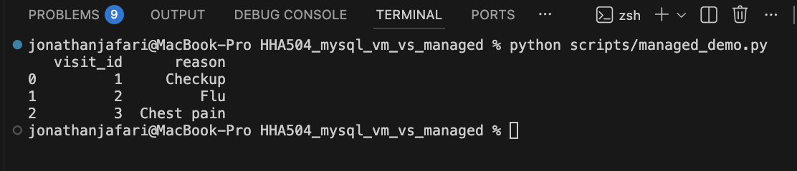

---

# 🧪 Python Demo Scripts

## **VM Demo**
```
scripts/vm_demo.py
```

## **Managed SQL Demo**
```
scripts/managed_demo.py
```

Includes SSL parameters to connect to Cloud SQL:

```python
ssl_args = {
    "ssl": {
        "ca": "ssl/server-ca.pem",
        "cert": "ssl/client-cert.pem",
        "key": "ssl/client-key.pem"
    }
}
```

---

# 📦 Part 3 — Final Comparison & Summary

### **VM MySQL**
| Feature | Result |
|--------|--------|
| Installation | Manual (apt install) |
| Updates | Manual |
| SSL | Must configure manually |
| Scaling | Hard |
| Backups | Manual |
| Maintenance | User responsibility |

### **Managed Cloud SQL**
| Feature | Result |
|--------|--------|
| Installation | Auto / 1-click |
| Updates | Auto |
| SSL | Pre-generated certificates |
| Scaling | Easy |
| Backups | Automatic |
| Maintenance | Google handles it |

---

# 📸 Screenshot Index

### **VM**
All VM screenshots stored at:  
`screenshots/vm/`

### **Managed**
All Managed SQL screenshots stored at:  
`screenshots/managed/`

---

# ✅ Completed Requirements

✔ VM created & configured  
✔ MySQL installed and externally accessible  
✔ Python VM connection script working  
✔ Managed SQL instance created  
✔ Authorized networks configured  
✔ SSL certificate page captured  
✔ Python managed connection successful  
✔ Repository organized professionally  
✔ README fully documented  

---

## 📄 Assignment Information

**Student:** Jonathan Jafari  
**Course:** *HHA 504 — Cloud Foundations*  
**Assignment:** *VM vs Managed SQL — MySQL Deployment Comparison* 


